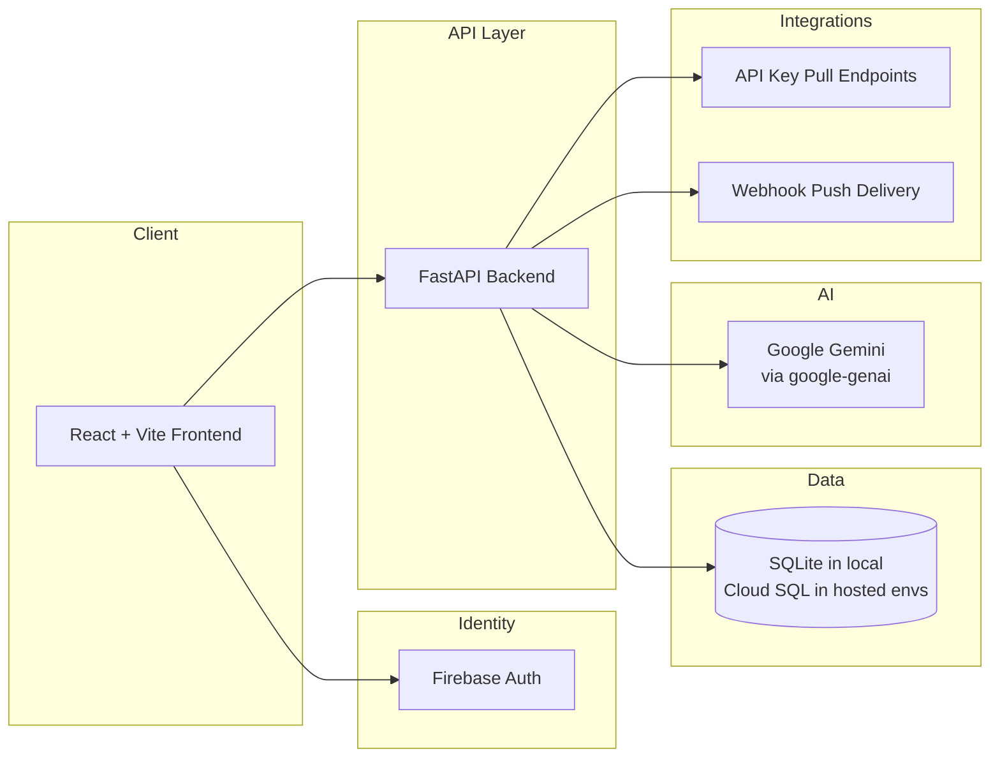

# ResilAI Architecture

ResilAI is an AI Incident Readiness Platform built as a web application with API-first integration capabilities.

## System Overview

## Frontend

- Framework: **React + Vite + TypeScript**
- Hosting: **Firebase Hosting**
- Runtime config via `import.meta.env.*`
- Key areas:
  - Assessment workflow
  - Results and analytics
  - Integrations and settings
  - Public trust pages (`/about`, `/security`, `/status`, `/pilot`)

## Backend

- Framework: **FastAPI**
- ORM/Migrations: **SQLAlchemy + Alembic**
- Responsibilities:
  - Assessment lifecycle and scoring
  - Framework mappings (MITRE/CIS/OWASP)
  - Report generation (PDF)
  - Integration endpoints (API keys, webhooks, exports)
  - Health/runtime diagnostics

## Database

- Local development: `sqlite:///./airs_dev.db`
- Hosted environments: Cloud SQL-compatible connection string
- Migration management with Alembic

## Hosting and Runtime

- Backend deployed to **Google Cloud Run**
- Frontend deployed to **Firebase Hosting**
- Environment separation:
  - Local (`ENV=local`)
  - Staging
  - Production

## LLM Integration

- SDK: **`google-genai`** (`google.genai`)
- Usage scope: narrative generation only
- Deterministic scoring remains rule-based
- Health endpoint: `/health/llm` for runtime visibility

## Integration Architecture

### API Key Pull

- Org-scoped API key creation
- Hashed key storage
- Header auth (current compatibility header: `X-AIRS-API-Key`)
- External ingestion endpoint for latest score and findings

### Webhook Push

- Org-level webhook subscriptions
- Event payload delivery on scoring completion
- Retry/backoff behavior and failure logging
- Test endpoint for delivery validation

## Trust and Security Boundaries

- Public frontend communicates only with configured API base URL
- Auth state and tokens managed by Firebase client SDK
- Backend performs authorization and org scoping
- Secrets are expected through environment variables or secret manager bindings
