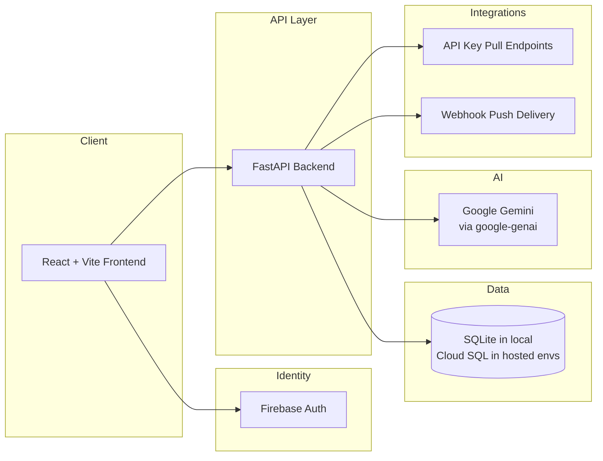

# ResilAI Architecture

ResilAI is an AI Incident Readiness Platform built as a web application with API-first integration capabilities.

## System Overview

```mermaid
flowchart LR
  subgraph Client
    FE[React + Vite Frontend]
  end

  subgraph Identity
    AUTH[Firebase Auth]
  end

  subgraph API Layer
    BE[FastAPI Backend]
  end

  subgraph Data
    DB[(SQLite in local\nCloud SQL in hosted envs)]
  end

  subgraph AI
    LLM[Google Gemini\nvia google-genai]
  end

  subgraph Integrations
    APIKEY[API Key Pull Endpoints]
    WEBHOOK[Webhook Push Delivery]
  end

  FE --> AUTH
  FE --> BE
  BE --> DB
  BE --> LLM
  BE --> APIKEY
  BE --> WEBHOOK
```

## Frontend

- Framework: **React + Vite + TypeScript**
- Hosting: **Firebase Hosting**
- Runtime config via `import.meta.env.*`
- Key areas:
  - Assessment workflow
  - Results and analytics
  - Integrations and settings
  - Public trust pages (`/about`, `/security`, `/status`, `/pilot`)

## Backend

- Framework: **FastAPI**
- ORM/Migrations: **SQLAlchemy + Alembic**
- Responsibilities:
  - Assessment lifecycle and scoring
  - Framework mappings (MITRE/CIS/OWASP)
  - Report generation (PDF)
  - Integration endpoints (API keys, webhooks, exports)
  - Health/runtime diagnostics

## Database

- Local development: `sqlite:///./airs_dev.db`
- Hosted environments: Cloud SQL-compatible connection string
- Migration management with Alembic

## Hosting and Runtime

- Backend deployed to **Google Cloud Run**
- Frontend deployed to **Firebase Hosting**
- Environment separation:
  - Local (`ENV=local`)
  - Staging
  - Production

## LLM Integration

- SDK: **`google-genai`** (`google.genai`)
- Usage scope: narrative generation only
- Deterministic scoring remains rule-based
- Health endpoint: `/health/llm` for runtime visibility

## Logic Firewall Core Module

ResilAI includes a deterministic prompt-injection defense layer as a core module:

`[Retrieval Layer] -> [Logic Firewall] -> [LLM (Gemini)] -> [Response]`

This design enforces:

- Security-first pre-LLM context validation
- Deterministic and explainable controls (no LLM in detection path)
- Enterprise-ready traceability via logic trace and audit-ready events

The Logic Firewall flow detects poisoned retrieval patterns (MITRE AML.T0031),
quarantines malicious chunks, and only forwards sanitized context to Gemini.

## Integration Architecture

### API Key Pull

- Org-scoped API key creation
- Hashed key storage
- Header auth (current compatibility header: `X-AIRS-API-Key`)
- External ingestion endpoint for latest score and findings

### Webhook Push

- Org-level webhook subscriptions
- Event payload delivery on scoring completion
- Retry/backoff behavior and failure logging
- Test endpoint for delivery validation

## Trust and Security Boundaries

- Public frontend communicates only with configured API base URL
- Auth state and tokens managed by Firebase client SDK
- Backend performs authorization and org scoping
- Secrets are expected through environment variables or secret manager bindings

## Compliance-as-Code & Validation Gates

ResilAI enforces a zero-trust compliance model via automated policy-enforcement gates within the CI/CD pipeline and the application runtime.

### 1. Registry & Scoring Logic Merge Guard (CI Gate)
- **Policy**: Pushing changes to core scoring rubrics, question catalogs, or framework-mapping registries triggers mandatory checks that block branch merging if tests fail.
- **Implementation**: The GitHub workflow [ci.yml](.github/workflows/ci.yml) executes [check_igvf_gate.py](scripts/check_igvf_gate.py) to identify modifications to:
  - Framework mapping registry (`app/core/frameworks.py`)
  - Scoring questionnaires/rubric (`app/core/rubric.py`)
  - Scoring engine (`app/services/scoring.py` and `app/services/governance/scoring_v2.py`)
  - IGVF engine metrics (`app/services/governance/`)
- **Enforcement**: If changes exist, `check_igvf_gate.py` runs `pytest tests/test_igvf.py`. Any regression or failure aborts the check-in and blocks merging the PR.

### 2. Required Deployment Status Check (CD Gate)
- **Policy**: No code can be deployed to production unless compliance checks are fully satisfied.
- **Implementation**: The deployment workflow [deploy.yml](.github/workflows/deploy.yml) injects a required `Compliance-Verified` job.
- **Enforcement**: The `deploy-production` job depends explicitly on the `compliance-verified` status check. The gate executes `pytest tests/test_igvf.py` and `validate_governance.py --brief`, checking that the codebase and organization configurations are fully validated.

### 3. Automated Compliance Export (Dashboard Update Trigger)
- **Policy**: Every operational change that updates the compliance assessment dashboard must be cryptographically recorded in our secure ledger.
- **Implementation**: Background tasks run in the FastAPI API endpoints when:
  - An assessment is scored/re-evaluated (`POST /assessments/{assessment_id}/score`)
  - A new finding is created (`POST /assessments/{assessment_id}/findings`)
  - A finding status/details are updated (`PATCH /assessments/{assessment_id}/findings/{finding_id}`)
  - Governance profile parameters are updated (`PUT /governance/{org_id}/profile`)
- **Action**: Generates a timestamped PDF compliance report, signs it cryptographically using HMAC-SHA256 with the `COMPLIANCE_SIGNING_KEY` secret, and uploads the PDF and metadata ledger directly to the secure Cloud Storage bucket (`COMPLIANCE_GCS_BUCKET` e.g., `resilai-audit-ledgers-prod` or `-staging`).
