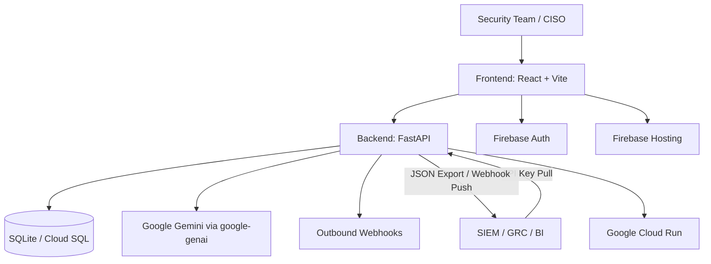

# ResilAI

**ResilAI** is an **AI Incident Readiness Platform** that helps organizations measure, improve, and report their preparedness for AI-era security incidents.

[Public Beta](https://airs-staging-0384513977.web.app) | [Staging API Docs](https://airs-api-staging-227825933697.us-central1.run.app/docs) | [Documentation](https://purvanshbhatt.github.io/AIRS/)

## Problem Statement
Most organizations have SIEM, endpoint, and cloud tooling, but still lack a clear and repeatable way to answer:

- How ready are we for AI-related security incidents?
- What are our highest-risk readiness gaps?
- What should we fix first for executive and board reporting?

ResilAI closes this gap with deterministic scoring, framework alignment, and executive-ready outputs.

## Key Features
- Deterministic AI incident readiness scoring
- MITRE ATT&CK, CIS Controls, and OWASP mapping
- Executive Risk Summary and detailed PDF reporting
- API key-based pull integrations for external platforms
- Webhook-based push integrations for event-driven workflows
- Health and runtime diagnostics for operational transparency

## Architecture Diagram



## Public Beta
- Frontend (staging): `https://airs-staging-0384513977.web.app`
- Backend health: `https://airs-api-staging-227825933697.us-central1.run.app/health`
- Backend docs: `https://airs-api-staging-227825933697.us-central1.run.app/docs`

## Screenshots

Screenshot placeholders for launch materials:
- `docs/assets/screenshots/dashboard-placeholder.svg`
- `docs/assets/screenshots/results-placeholder.svg`
- `docs/assets/screenshots/integrations-placeholder.svg`

## Quick Start

### Local Development (PowerShell)

```powershell
py -3 -m pip install -r requirements.txt
Copy-Item .env.dev.example .env.dev
$env:ENV="local"
py -3 -m alembic upgrade head
py -3 -m uvicorn app.main:app --reload --host 0.0.0.0 --port 8000
```

In another terminal:

```powershell
cd frontend
npm ci
npm run dev -- --host 0.0.0.0 --port 5173
```

### Staging Build + Deploy (PowerShell)

```powershell
cd frontend
npm ci
npm run build:staging
cd ..
firebase deploy --only hosting:staging
bash ./scripts/deploy_cloud_run.sh --service airs-api-staging --region us-central1 --env-file gcp/env.staging.yaml --project gen-lang-client-0384513977
```

## Roadmap Summary
- Beta stabilization and demo hardening
- Enterprise integrations (API keys, webhooks, SIEM-ready exports)
- Executive reporting and continuous readiness workflows
- Expanded observability, compliance, and pilot onboarding

See full plan in `ROADMAP.md`.

## Design Partner Program
We are onboarding a limited set of design partners (Series B/C startups and security teams).

If you want early access and direct product influence, contact: `purvansh95b@gmail.com`

## Repository Structure

```text
.
|-- app/                      # FastAPI backend
|-- frontend/                 # React + Vite frontend
|-- alembic/                  # Database migrations
|-- docs/                     # GitHub Pages documentation source
|-- scripts/                  # Deployment and utility scripts
`-- .github/                  # CI/CD and community templates
```

## Security and Compliance
- Security policy: `SECURITY.md`
- Architecture and trust boundaries: `ARCHITECTURE.md`
- API references and docs: `docs/`

## License
This project is licensed under **GNU AGPL-3.0**. See `LICENSE`.
