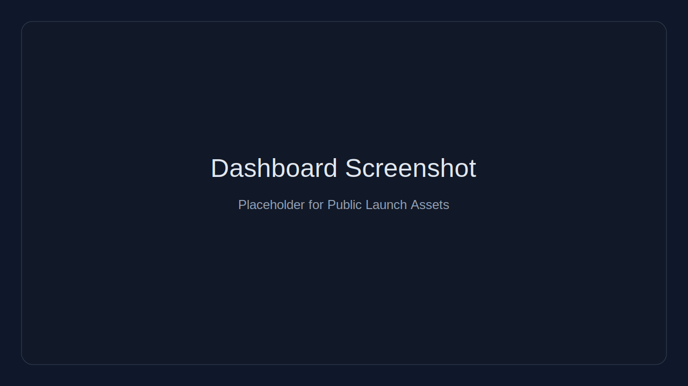
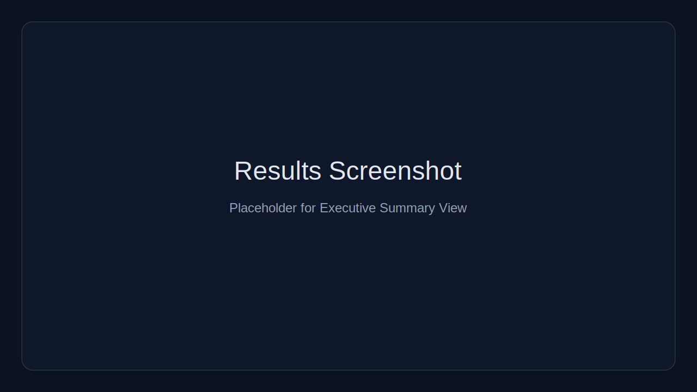
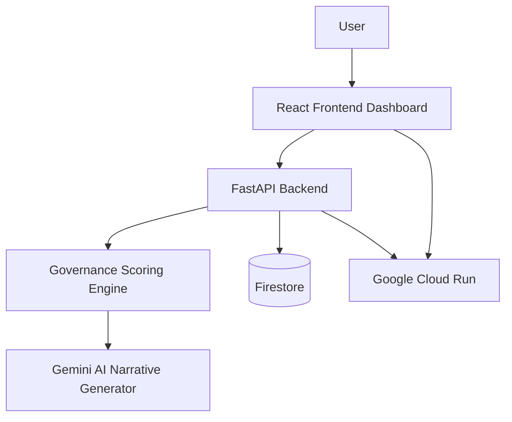

# ResilAI

AI-powered incident readiness platform for cybersecurity teams.

[Demo Video](https://youtu.be/Z_0aNizadoU) | [GitHub](https://www.github.com/purvanshbhatt/AIRS) | [API Docs](https://airs-api-227825933697.us-central1.run.app/docs)

## What is ResilAI?

ResilAI is an AI-powered incident readiness platform that helps organizations measure their preparedness for cybersecurity incidents.

Instead of only monitoring threats, ResilAI calculates readiness scores using deterministic governance rules and uses Gemini to generate executive risk narratives.

The result is a system that translates complex security signals into clear leadership insights.

Deterministic scoring engine with AI-assisted executive interpretation.

## Problem

Traditional security tools focus on monitoring threats, but organizations struggle to translate technical security signals into clear executive risk insights.

Teams need a fast and auditable way to answer:
- How prepared are we for a real incident?
- Which control gaps matter most now?
- How do we communicate readiness to leadership?

## Solution

ResilAI combines deterministic governance scoring with AI-generated executive risk narratives powered by Gemini.

The system calculates incident readiness using structured security inputs and then uses Gemini to generate executive-level risk summaries.

## Architecture

ResilAI uses a hybrid architecture that keeps scoring deterministic and AI explanatory:
- Frontend: React + Vite
- Backend: FastAPI
- Deterministic scoring layer: Governance Scoring Engine
- AI layer: Gemini Flash
- Infrastructure: Google Cloud Run + Firestore

This architecture ensures AI assists interpretation without affecting deterministic risk scoring logic.

## Dashboard

## Architecture Diagram

```mermaid
flowchart TD
    U[User] --> FE[React Frontend Dashboard]
    FE --> API[FastAPI Backend]
    API --> SCORE[Governance Scoring Engine]
    SCORE --> AI[Gemini AI Narrative Generator]
    API --> FS[(Firestore)]
    FE --> CR[Google Cloud Run]
    API --> CR
```

## Technology Stack

Frontend:
React + Vite

Backend:
FastAPI

AI:
Gemini Flash via Google GenAI SDK

Infrastructure:
Google Cloud Run
Firestore

## Future Vision

ResilAI aims to become a governance intelligence layer for security operations.

Future capabilities include:
- SIEM integrations (Splunk / Sentinel)
- Automated readiness simulations
- Executive board risk dashboards
- Cross-organization benchmarking

## 3 Small Improvements for a Huge Competitive Edge

### 1. Cold Start Onboarding (UX)
- Pre-seed a sample organization so the demo opens with meaningful charts and findings.

### 2. NIST 2.0 Deep-Link (Authority)
- Add UI tooltips with explicit NIST CSF 2.0 mappings (for example, ID.AM-P1) to demonstrate regulatory depth.

### 3. Gemini Feedback Loop (Technical)
- Add a regenerate-with-context flow so users can refine executive summaries by tone/detail.

## Submission Checklist

- Demo video
- Subtitles
- GitHub repository
- Architecture diagram
- README
- JUDGE_MODE.md
- Submission description

## Judge Quick Link

For a 2-minute walkthrough, see [docs/JUDGE_MODE.md](docs/JUDGE_MODE.md).

## License

GNU AGPL-3.0 (see `LICENSE`).
