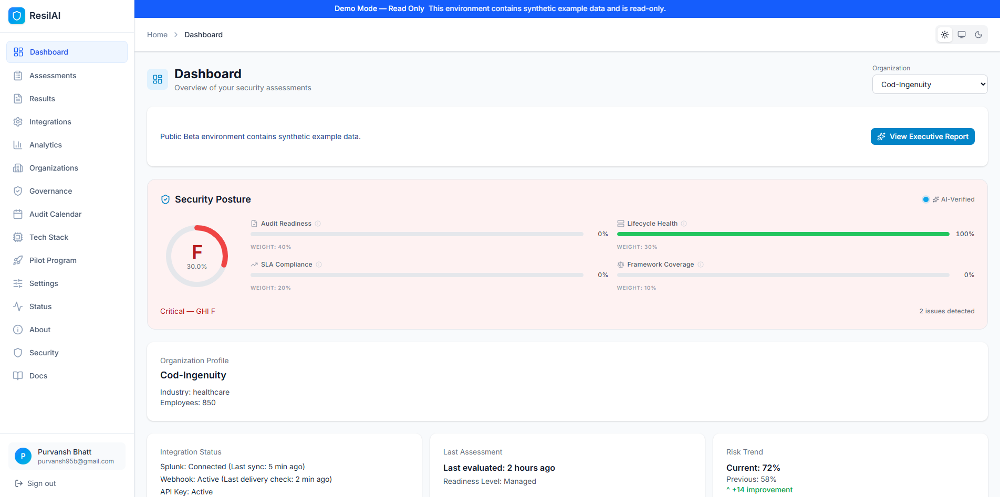
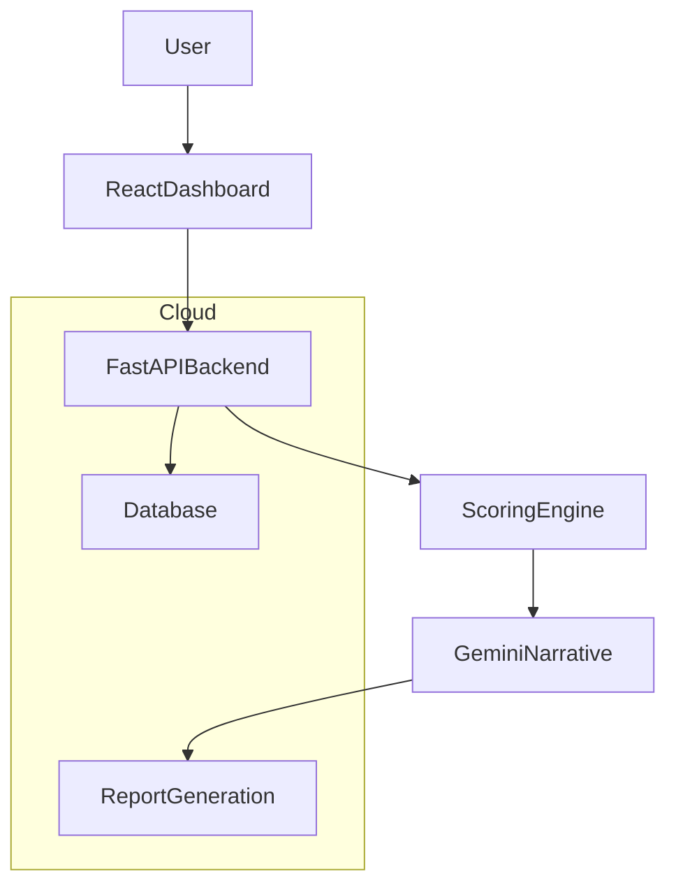

# ResilAI — AI Incident Readiness System (AIRS)

AI-powered incident readiness platform for cybersecurity teams.

[Demo Video](https://youtu.be/Z_0aNizadoU) | [GitHub](https://github.com/purvanshbhatt/AIRS) | [API Docs](https://airs-api-227825933697.us-central1.run.app/docs)

## Judge Quick Start

1. Watch the 3-minute demo
2. Review the architecture diagram
3. Explore the scoring methodology

Demo:
https://youtu.be/Z_0aNizadoU

## What is ResilAI?

ResilAI is an AI-powered incident readiness platform that helps organizations measure their preparedness for cybersecurity incidents.

Instead of only monitoring threats, ResilAI calculates readiness scores using deterministic governance rules and uses Gemini to generate executive risk narratives.

The result is a system that translates complex security signals into clear leadership insights.

## 30-Second Product Pitch

ResilAI measures how prepared an organization is for security incidents.

It calculates deterministic readiness scores aligned with frameworks like NIST CSF and CIS Controls.

Gemini AI then translates technical findings into clear executive risk narratives.

The result is a platform that converts security telemetry into board-level intelligence.

Deterministic scoring engine with AI-assisted executive interpretation.

## Problem

Traditional monitoring tools surface threats but do not answer a core leadership question: are we operationally ready for an incident?

Organizations still struggle to convert technical security signals into executive-grade risk insight.

## Solution

ResilAI combines deterministic governance scoring with AI-generated executive narratives powered by Gemini.

Deterministic scoring produces auditable readiness outputs, while Gemini provides qualitative interpretation for leadership communication.

## Dashboard

## Architecture

```mermaid
flowchart TD

User --> ReactDashboard
ReactDashboard --> FastAPIBackend
FastAPIBackend --> ScoringEngine
ScoringEngine --> GeminiNarrative
FastAPIBackend --> Database

GeminiNarrative --> ReportGeneration

subgraph Cloud
FastAPIBackend
Database
ReportGeneration
end
```

## AI Usage with Gemini

Gemini Flash is used for narrative intelligence only.

LLM usage is strictly scoped to qualitative insights; scoring remains rule-based.

## Technical Stack

- Frontend: React + Vite
- Backend: FastAPI
- AI: Gemini Flash via Google GenAI SDK
- Infrastructure: Google Cloud Run + Firestore

## Future Vision

ResilAI aims to become a governance intelligence layer for security operations.

Future capabilities include:
- SIEM integrations (Splunk / Sentinel)
- Automated readiness simulations
- Executive board risk dashboards
- Cross-organization benchmarking

## Repository Assets

- Quick walkthrough: [docs/QUICK_WALKTHROUGH.md](docs/QUICK_WALKTHROUGH.md)
- Security design: [SECURITY.md](SECURITY.md)
- Deep architecture rationale: [ARCHITECTURE.md](ARCHITECTURE.md)

## License

GNU AGPL-3.0 (see `LICENSE`).
