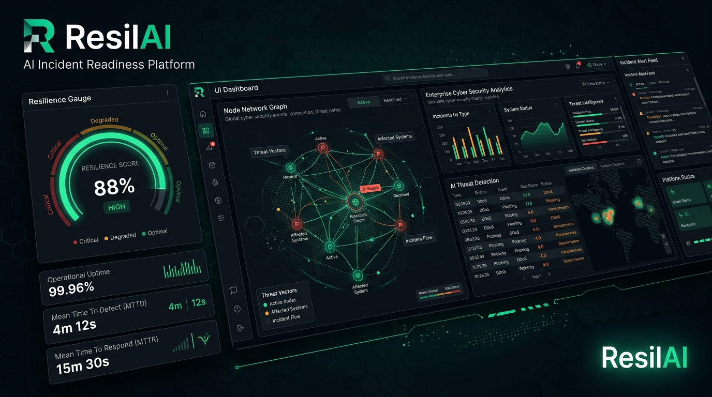
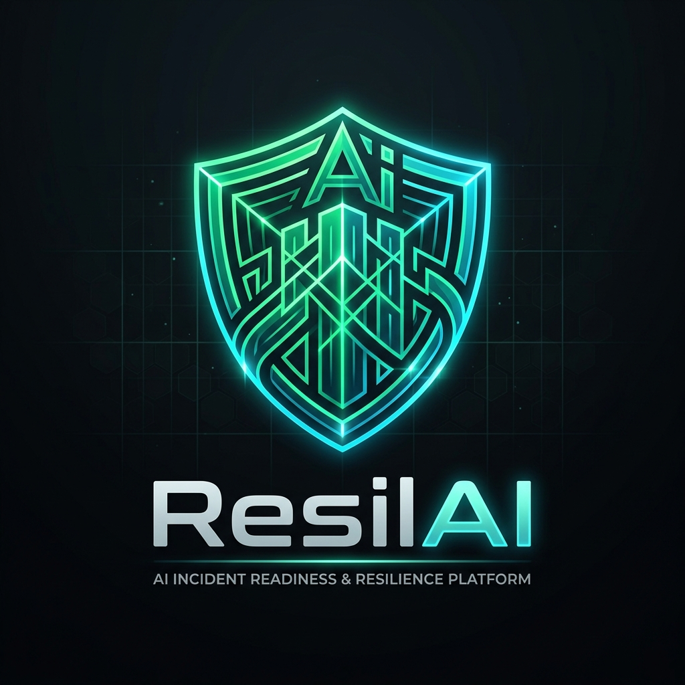
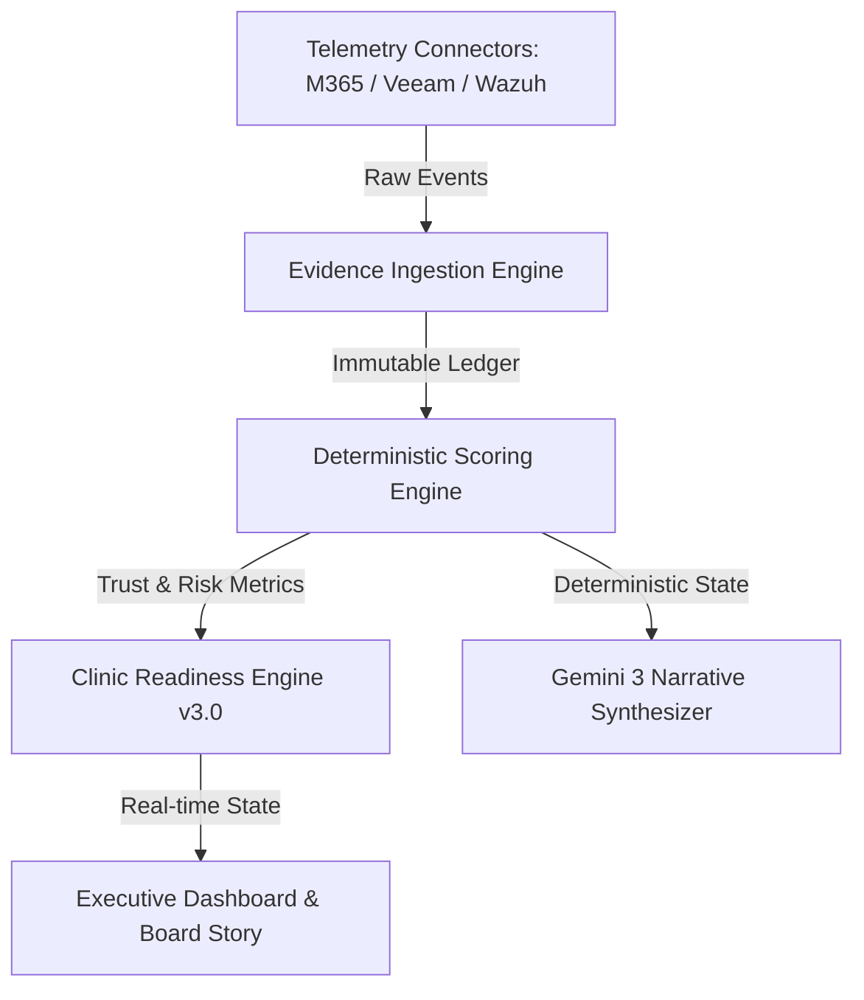

<p align="center">
  
</p>

<h1 align="center">
  
  ResilAI — AI Incident Readiness & Clinic Operations Platform
</h1>

<p align="center">
  <b>Continuous, Deterministic Cyber Resilience & Operational Readiness Engine for Healthcare & Critical Systems</b>
</p>

<p align="center">
  <a href="https://github.com/purvanshbhatt/AIRS/actions"></a>
  <a href="https://resilai.org"></a>
  <a href="https://staging.resilai.org"></a>
  <a href="LICENSE"></a>
  <a href="docs/SECURITY.md"></a>
</p>

---

## 🛡️ Executive Summary

**ResilAI** is an enterprise-grade **AI Incident Readiness & Operational Resilience Platform**. It transitions organizations away from subjective, manual GRC questionnaires toward continuous, **deterministic, evidence-first readiness scoring**.

Through direct integrations with critical operational infrastructure (Microsoft 365, Veeam Backup, Wazuh EDR, Splunk SIEM, AWS SSM), ResilAI calculates real-time **Clinic Readiness**, **Trust Factors**, **Coverage Scores**, and **Business Risk** without hallucination or LLM-fabricated scoring.

---

## ✨ Key Capabilities

| Capability | Description |
| :--- | :--- |
| **Deterministic Scoring Engine** | Mathematical, non-LLM readiness calculation based on raw infrastructure evidence. |
| **Clinic Readiness Module (v3.0)** | Real-time operational continuity monitoring for critical medical devices, EHR integrations, and emergency workflows. |
| **Evidence Network & Ledger** | Immutable audit trail mapping telemetry inputs directly to compliance and resilience drivers. |
| **Board-Story Generator** | Executive-ready narrative synthesis powered by Gemini 3 Flash, wrapped in mathematical guardrails. |
| **Zero-Trust Telemetry Adapters** | Direct API adapters for Microsoft Graph, Veeam Backup & Replication, Wazuh SIEM, and AWS SSM. |

---

## 🏛️ Platform Architecture


```mermaid
graph TD
    A[Telemetry Connectors: M365 / Veeam / Wazuh] -->|Raw Events| B[Evidence Ingestion Engine]
    B -->|Immutable Ledger| C[Deterministic Scoring Engine]
    C -->|Trust & Risk Metrics| D[Clinic Readiness Engine v3.0]
    D -->|Real-time State| E[Executive Dashboard & Board Story]
    C -->|Deterministic State| F[Gemini 3 Narrative Synthesizer]
```

---

## 📂 Documentation Navigation

* 📖 **[Executive Overview](EXECUTIVE_OVERVIEW.md)** — High-level business overview, moat, and target ROI.
* ⚙️ **[Readiness Engine Core](READINESS_ENGINE.md)** — In-depth breakdown of deterministic scoring algorithms.
* 🏥 **[Clinic Pilot Guide](PILOT_GUIDE.md)** — Onboarding & operational guide for healthcare design partners.
* 🔌 **[Connector Architecture](CONNECTORS.md)** — Integration specs for Microsoft, Veeam, Wazuh, and Splunk.
* 🚀 **[Deployment Guide](DEPLOYMENT.md)** — Cloud Run, Firebase Hosting, and Firestore setup.
* 🔐 **[Security & Governance](SECURITY.md)** — Data isolation, field-level encryption, and compliance controls.
* 🏛️ **[Full Architecture Specification](ARCHITECTURE.md)** — System design and data contracts.
* 💼 **[Business Model & Strategy](BUSINESS_MODEL.md)** — Go-to-market and MSP tiering.
* 📑 **[Historical v1 Archive](docs/v1/README.md)** — Preserved Enterprise Assessment Platform v1 docs.

---

## 🚀 Quick Start (Local Development)

```bash
# 1. Clone & install backend
git clone https://github.com/purvanshbhatt/AIRS.git
cd AIRS
python -m venv venv
source venv/bin/activate  # or venv\Scripts\activate on Windows
pip install -r requirements.txt

# 2. Run backend dev server
uvicorn app.main:app --reload --port 8000

# 3. In a separate terminal, start frontend
cd frontend
npm install
npm run dev
```

---

## 📜 License & Compliance

Copyright © 2026 ResilAI Inc. All rights reserved. Proprietary software.
