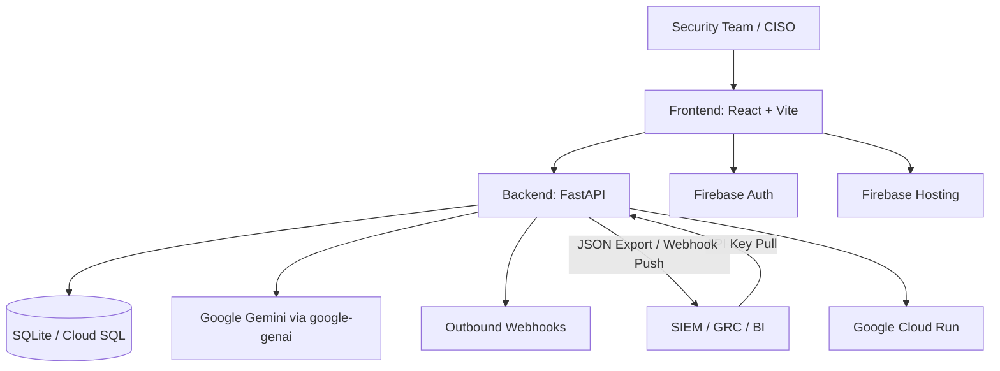
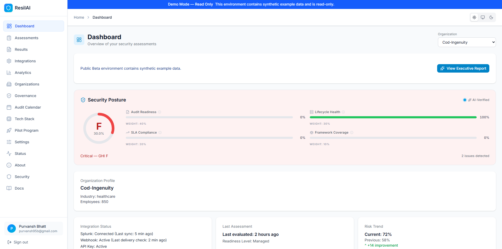
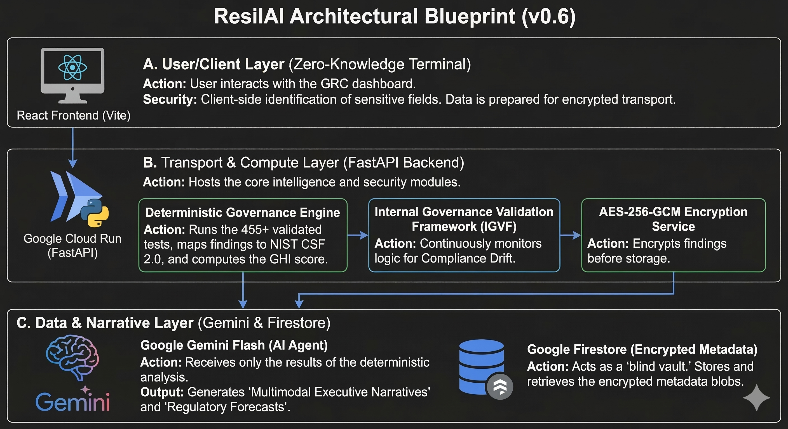

# ResilAI

**ResilAI** is an **AI Incident Readiness Platform** that helps organizations measure, improve, and report their preparedness for AI-era security incidents.

[Live Demo](https://gen-lang-client-0384513977.web.app) | [API Docs](https://airs-api-227825933697.us-central1.run.app/docs) | [Documentation](https://purvanshbhatt.github.io/AIRS/)

## Problem Statement
Did you ever wonder: "Are we safe if an Artificial Intelligence system goes wrong?" While most organizations have standard security tools (like antivirus or network monitors), they often struggle to answer:

- How prepared are we for a cyber incident specifically involving AI?
- What are our biggest vulnerabilities when it comes to AI tools?
- How do we explain these risks simply to executives or the board of directors?

ResilAI solves this problem. We provide clear, easy-to-understand scoring, alignment with known safety frameworks, and reports designed for business leaders—not just IT experts.

## Understanding ResilAI: A Guide for Everyone
If you do not work in IT or Cybersecurity, here are the core concepts of ResilAI in plain English:

1. **AI Readiness Score:** Just like a credit score tells you your financial health, ResilAI gives your company a "Readiness Score" to tell you how safe you are from AI-specific cyber threats.
2. **Attack Simulation Lab:** Think of this as a fire drill. You can safely "attack" an AI assistant using provided templates (like tricking it into giving away secrets) so you can see how our Logic Firewall stops bad behavior before it happens.
3. **Reliability Dashboard:** A single, easy-to-read screen showing your exact risk level (Critical, High, Medium, Low), complete with a simple explanation of what it means for your business.
4. **Governance & Compliance:** ResilAI automatically checks your AI systems against global rules and best practices, making sure you aren't unknowingly breaking laws or compliance policies.

## Key Features
- **Deterministic Scoring:** Crystal-clear numbers indicating exactly how secure your AI deployments are.
- **Recognized Standards:** We map all risks to industry standards like MITRE ATT&CK, CIS Controls, and OWASP.
- **Executive-Ready Reports:** Generate simple, attractive PDF reports that make sense to the C-suite and board.
- **Automated Workflow Integrations:** Smoothly connect with your existing tools via simple API keys or Webhooks.
- **Transparent Diagnostics:** Real-time health metrics ensuring the platform is always running smoothly.

## Architecture Diagram


```mermaid
graph TD
  U[Security Team / CISO] --> FE[Frontend: React + Vite]
  FE --> BE[Backend: FastAPI]
  FE --> AUTH[Firebase Auth]
  BE --> DB[(SQLite / Cloud SQL)]
  BE --> LLM[Google Gemini via google-genai]
  BE --> WH[Outbound Webhooks]
  EXT[SIEM / GRC / BI] -->|API Key Pull| BE
  BE -->|JSON Export / Webhook Push| EXT
  FE --> HOST[Firebase Hosting]
  BE --> RUN[Google Cloud Run]
```

## Live Demo
- Frontend (demo): `https://gen-lang-client-0384513977.web.app`
- Backend health: `https://airs-api-227825933697.us-central1.run.app/health`
- Backend docs: `https://airs-api-227825933697.us-central1.run.app/docs`

## Environments

ResilAI operates in three distinct environments:

| Environment | Purpose | URLs | Writes |
|---|---|---|---|
| **Demo** | Investor presentations, frozen synthetic data | `gen-lang-client-0384513977.web.app` | ❌ Read-only |
| **Staging** | Active development, testing | `airs-staging-0384513977.web.app` | ✅ Enabled |
| **Local** | Developer workstations | `localhost:5173` / `localhost:8000` | ✅ Enabled |

### Demo Mode

When `ENV=demo`, all write endpoints return **403 Forbidden**. This ensures:
- Synthetic demo data remains pristine for investor presentations
- UI buttons that trigger writes are hidden in the frontend
- Backend enforces read-only at the API layer via `require_writable` guards

Demo mode is controlled by:
- Backend: `ENV=demo` in `gcp/env.prod.yaml`
- Frontend: `/health/system` endpoint returns `is_read_only: true`

## Screenshots

Actual launch visuals:





## Quick Start

### Local Development (PowerShell)

```powershell
py -3 -m pip install -r requirements.txt
Copy-Item .env.dev.example .env.dev
$env:ENV="local"
py -3 -m alembic upgrade head
py -3 -m uvicorn app.main:app --reload --host 0.0.0.0 --port 8000
```

In another terminal:

```powershell
cd frontend
npm ci
npm run dev -- --host 0.0.0.0 --port 5173
```

### Staging Build + Deploy (PowerShell)

```powershell
cd frontend
npm ci
npm run build:staging
cd ..
firebase deploy --only hosting:staging
bash ./scripts/deploy_cloud_run.sh --service airs-api-staging --region us-central1 --env-file gcp/env.staging.yaml --project gen-lang-client-0384513977
```

For encrypted Firestore writes in staging/demo, bind the encryption key from Secret Manager at deploy time:

```bash
bash ./scripts/deploy_cloud_run.sh --service airs-api-staging --region us-central1 --env-file gcp/env.staging.yaml --project gen-lang-client-0384513977 --set-secrets ENCRYPTION_SECRET=ENCRYPTION_SECRET:latest
bash ./scripts/deploy_cloud_run.sh --service airs-api --region us-central1 --env-file gcp/env.demo.yaml --project gen-lang-client-0384513977 --prod --set-secrets ENCRYPTION_SECRET=ENCRYPTION_SECRET:latest
```

## Enterprise Readiness

As of **v0.3-enterprise-beta**, ResilAI ships with the following enterprise-grade capabilities:

| Capability | Detail |
|---|---|
| **NIST CSF 2.0 Alignment** | Every finding is tagged to a NIST CSF 2.0 Function (GV, ID, PR, DE, RS, RC) and category (e.g. `DE.CM-3`) |
| **Maturity Tiers** | Scoring rubric v2.0.0 distinguishes Basic → Managed → Advanced maturity for key controls |
| **Enterprise Roadmap** | Effort vs. Impact matrix with Immediate / Near-term / Strategic timeline lanes |
| **Scoring Transparency** | `/api/v1/methodology` endpoint exposes full rubric weights, NIST mappings, and scoring formula |
| **Analytics Governance** | Per-organisation `analytics_enabled` flag — tunable via Settings UI or `PATCH /api/orgs/{id}/analytics` |
| **Audit Export** | `GET /api/orgs/{id}/audit/export` returns a signed JSON export of all audit events |
| **Schema Versioning** | `assessments.schema_version` column differentiates v1 (legacy) and v2 (maturity-tier) assessments |
| **Executive Reports** | PDF export includes NIST function breakdown, maturity gap analysis, and board-ready summary |

### Enterprise Pilot Programme

We run a structured **90-day enterprise pilot** with a limited cohort each quarter.
Apply at `/pilot` or email `purvansh95b@gmail.com` with subject `Enterprise Pilot Application`.

### API Versioning

- `/api/*` — stable, production API surface
- `/api/v1/*` — new enterprise endpoints (methodology, pilot leads)

## Roadmap Summary
- Beta stabilization and demo hardening
- Enterprise integrations (API keys, webhooks, SIEM-ready exports)
- Executive reporting and continuous readiness workflows
- Expanded observability, compliance, and pilot onboarding

See full plan in `ROADMAP.md`.

## Design Partner Program
We are onboarding a limited set of design partners (Series B/C startups and security teams).

If you want early access and direct product influence, contact: `purvansh95b@gmail.com`

## Repository Structure

```text
.
|-- app/                      # FastAPI backend
|-- frontend/                 # React + Vite frontend
|-- alembic/                  # Database migrations
|-- docs/                     # GitHub Pages documentation source
|-- scripts/                  # Deployment and utility scripts
`-- .github/                  # CI/CD and community templates
```

## Security and Compliance
- Security policy: `SECURITY.md`
- Architecture and trust boundaries: `ARCHITECTURE.md`
- API references and docs: `docs/`

## License
This project is licensed under **GNU AGPL-3.0**. See `LICENSE`.
