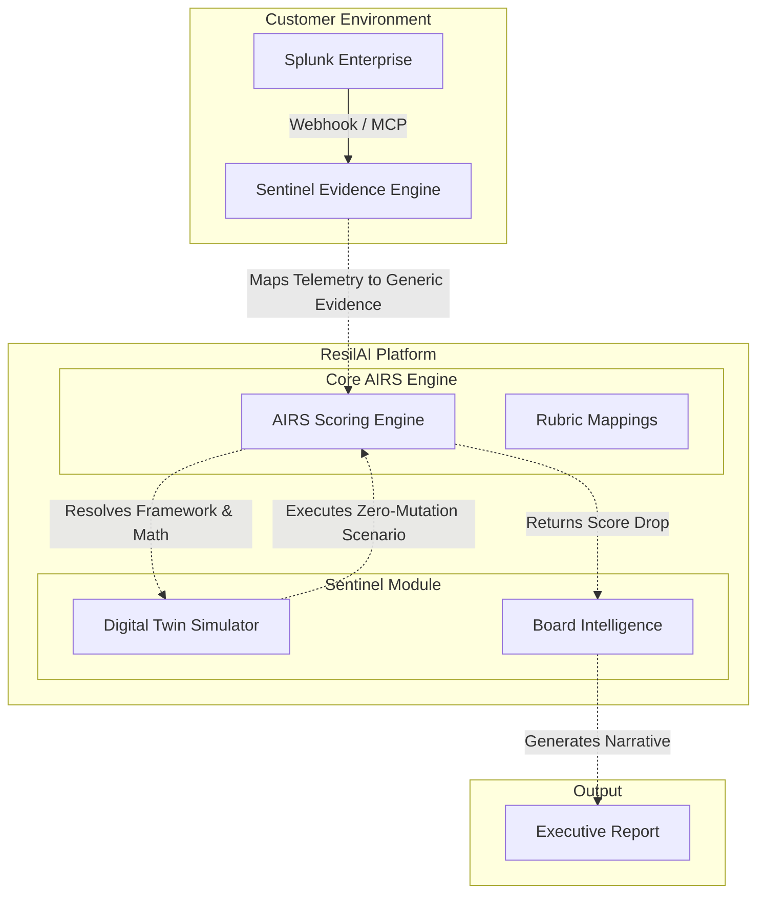

# Agentic Operations Architecture Diagram

This document serves as the specification for the visual architecture diagram to be included in the Hackathon submission. The diagram must illustrate the strict architectural boundaries that keep ResilAI enterprise-grade while integrating Splunk.

## Diagram Flow

## Key Narrative Elements
When drawing or presenting this architecture, emphasize the following points to the judges:
1. **Separation of Concerns:** Sentinel handles *Translation*, AIRS Core handles *Scoring*. 
2. **Zero-Mutation:** The Digital Twin creates isolated in-memory replicas of assessments to run scenarios, ensuring production data is never contaminated.
3. **Deterministic Constraints:** Gemini (Board Intelligence) is structurally prevented from hallucinating scores because the math is executed strictly by AIRS *before* hitting the LLM.
