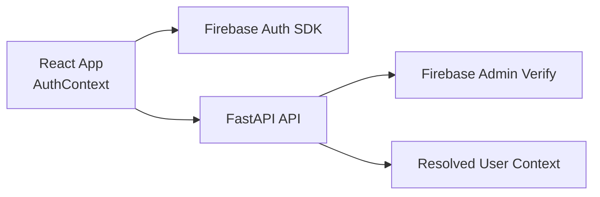

# ResilAI Authentication Integration

This guide documents Firebase Auth integration patterns for the ResilAI frontend and backend.

## Current Behavior

Authentication behavior is environment-driven:

- Local development: auth can be optional for faster iteration
- Hosted environments: bearer token validation is enforced by configuration

## Architecture



## Frontend Integration

### 1. Install Firebase SDK

```bash
cd frontend
npm install firebase
```

### 2. Configure client initialization

Use `frontend/src/lib/firebase.ts` with environment-backed config values:

- `VITE_FIREBASE_API_KEY`
- `VITE_FIREBASE_AUTH_DOMAIN`
- `VITE_FIREBASE_PROJECT_ID`

Development mode can connect to Auth Emulator when configured.

### 3. Auth context wiring

`frontend/src/contexts/AuthContext.tsx` should:

- subscribe to auth state
- expose current user
- provide `getToken()` for API calls
- support sign-in and sign-out flows

## Backend Integration

### 1. Install Firebase Admin

```bash
pip install firebase-admin
```

### 2. Verify tokens in auth dependency

`app/core/auth.py` performs token verification and returns structured user context.

### 3. Apply route protection

Use dependencies for protected routes:

- `Depends(require_auth)` for required authentication
- `Depends(get_current_user)` for optional user context

## Cloud Run Runtime Notes

- Configure service account permissions required for Firebase token verification
- Keep environment policy explicit for `AUTH_REQUIRED` and `ENV`
- Do not commit credentials to repository files

## Validation

### Local

- Start frontend and backend
- Start Firebase Auth Emulator (optional for local auth testing)
- Confirm authenticated and unauthenticated behaviors match environment policy

### Hosted

- Confirm missing token returns 401 where auth is required
- Confirm valid Firebase token is accepted and user context resolves

## Related Files

- `frontend/src/lib/firebase.ts`
- `frontend/src/contexts/AuthContext.tsx`
- `frontend/src/api.ts`
- `app/core/auth.py`
- `app/core/config.py`
