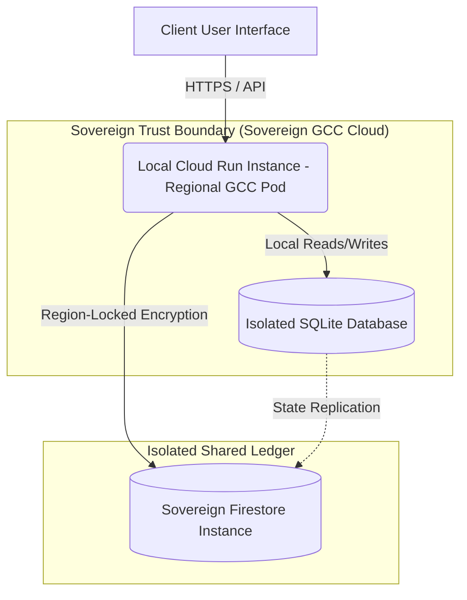

# ResilAI Sovereign Data Embassy Compliance & Architecture

This document specifies how the ResilAI architecture meets the strict **Sovereign Data Embassy** hosting requirements of GCC governments (such as Saudi Arabia's SDAIA, Qatar's QIA, and the UAE's Mubadala). 

As national trust and readiness infrastructure, ResilAI guarantees data residency, local isolation, and strict mathematical governance without compromising security.

---

## 1. Executive Summary: The Sovereign Data Moat

Sovereign procurement demands that critical compliance, risk, and security governance data remain completely isolated, unexposed to cross-border networks, and protected from third-party LLM leakage. 

ResilAI satisfies this demand through **Architectural Separation**:
- **Deterministic Governance Engine (DGE):** Runs purely local, mathematical logic to compute maturity ratings, risk indexes, and compliance gaps. This engine is immutable and fully local.
- **Narrative Generation Layer (LLM Speech):** Exclusively generates readability summaries and technical remediation guidance. Under no circumstances can the generative model modify, view, or touch raw, unstructured organizational databases or numeric scoring logic.

---

## 2. Persistence Isolation: The Cloud Data Embassy

ResilAI implements a **Dual-Persistence Pattern** to meet the strict definition of a Sovereign Data Embassy:

### Data Embassy Architecture Pillars
1. **Isolated Workspace Databases:** 
   Organizational state is written to isolated SQLite databases hosted locally within regional containers. There are no shared cross-tenant database instances.
2. **Region-Locked Firestore Ledger:**
   Firestore persistence is locked to regional GCC cloud zones (e.g., `me-central1` in Saudi Arabia or `me-west1` in Qatar). The dual-write pattern synchronizes local SQLite states to Firestore for persistence across Cloud Run cold starts, maintaining a zero-trust audit trail.
3. **Logic Firewall and Network Isolation:**
   All outbound traffic is subject to egress firewalls. Connections to external telemetry sources (e.g., Splunk, Wazuh, or Elastic SIEM) are established locally over secure VPNs or private endpoints (VPC Service Controls), preventing public internet traversal.

---

## 3. Generative Speech Isolation (LLM Guardrails)

To prevent cross-border data leakage and comply with national AI ethics frameworks:

- **No Public API Ingestion:** ResilAI does not use public generative endpoints. The Antigravity SDK routes requests through regional private LLM API endpoints or locally deployed sovereign LLM instances.
- **Strict Read-Only Context:** The `LLMNarrativeGenerator` and `AntigravityAgent` receive only highly-curated, structured finding parameters (e.g., title, severity, target control ID) rather than whole database dumps.
- **Zero Score Modification:** The narrative generator has no write access to the database or scores. Numeric compliance scores are calculated deterministically by local algorithms, ensuring they are audit-proof.

---

## 4. Verification and Attestation

ResilAI is audit-ready out-of-the-box:
1. **Immutable Audit Ledger:** Every state change, ticketing export, and agentic remediation proposal logs a cryptographically signed entry in `audit.py`.
2. **SIEM Telemetry Verification:** The system continuously verifies compliance controls using live, local data connectors (Wazuh, Splunk, Elastic) inside the sovereign network boundary, ensuring no logs leave the country.
