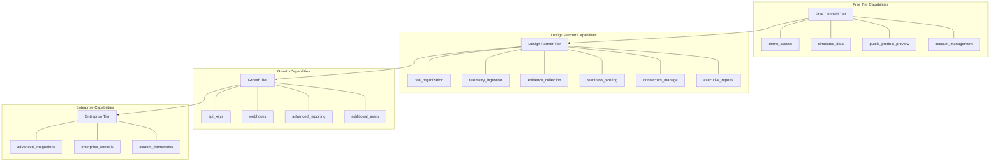
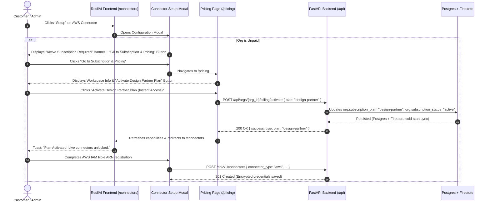

# ResilAI Entitlements and Access Granting Flow

This document defines the end-to-end access granting model, subscription paywall enforcement, and account isolation across ResilAI environments.

---

## 1. Access Model & Customer Progression

ResilAI enforces a strict four-stage access model:

| User State | Access Level | Data Boundary |
| :--- | :--- | :--- |
| **Visitor** | Marketing site, Pricing, Public Docs, Public Demo link | No organization or auth context |
| **Demo User** | Sandboxed simulated clinic workspace (`Acme Health Systems`) | Frozen synthetic data; read-only simulated actions |
| **Registered (Unpaid)** | Account profile, Organization overview, Preview schemas | No live infrastructure, no telemetry ingestion, no executive dossiers |
| **Design Partner / Subscriber** | Full product access, AWS & SIEM connectors, Continuous scoring | Live encrypted credentials, real telemetry feeds, immutable evidence ledger |

> [!IMPORTANT]
> **Core Tenet**: *Demo access is free. Product access is paid.*  
> Paywall gates are enforced **in the backend** via FastAPI authorization dependencies (`require_entitlement`), returning structured `HTTP 402 Payment Required` payloads when an organization lacks a capability.

---

## 2. Entitlements Hierarchy

Entitlements are mapped directly to subscription plans in `app/services/billing/entitlements.py`:



---

## 3. Paywall Enforcement Architecture

### Backend Enforcement (`app/core/entitlements.py`)
- Endpoints protecting live assets (e.g., `POST /api/v1/connectors`, `POST /api/v1/telemetry/events`, `POST /api/agent-audits`) declare:
  ```python
  _ent: None = Depends(require_entitlement(Entitlement.CONNECTORS_MANAGE))
  ```
- If the caller's organization lacks the entitlement, the middleware returns `HTTP 402` with structured error metadata:
  ```json
  {
    "error": {
      "code": "PAYMENT_REQUIRED",
      "message": "An active ResilAI subscription is required to access this feature.",
      "required_entitlement": "connectors_manage",
      "current_plan": "free",
      "upgrade_url": "/pricing",
      "request_id": "req-xyz-123"
    }
  }
  ```

### Administrator & Testing Bypass
- Accounts owned by or matching administrator identities (`purvansh95b@gmail.com`, `purvansh@resilai.org`, or `@resilai.org` domain) automatically bypass paywall checks.
- In both `app/core/entitlements.py` and `EntitlementService.is_exempt_org()`, administrator-owned organizations are granted `enterprise` tier capabilities immediately.
- Frontend `useCapabilities` verifies administrator email and activates full capabilities on the client side to prevent false-positive lock states during testing.

---

## 4. End-to-End Subscription Access Granting Flow

When a user encounters a paywalled feature (such as the AWS Security Hub connector):



---

## 5. Production Stripe Webhook Integration

For self-service production subscriptions:
1. **Checkout**: The customer selects Growth or Enterprise on `/pricing` and is redirected to Stripe Checkout.
2. **Webhook**: Stripe sends `checkout.session.completed` to `POST /api/billing/webhook`.
3. **Activation**: `CheckoutService._handle_checkout_completed()` matches `org_id` from metadata, commits active subscription status to PostgreSQL, and dual-writes to Cloud Firestore.
4. **Instant Unlock**: Next client API request immediately passes `require_entitlement` checks.
