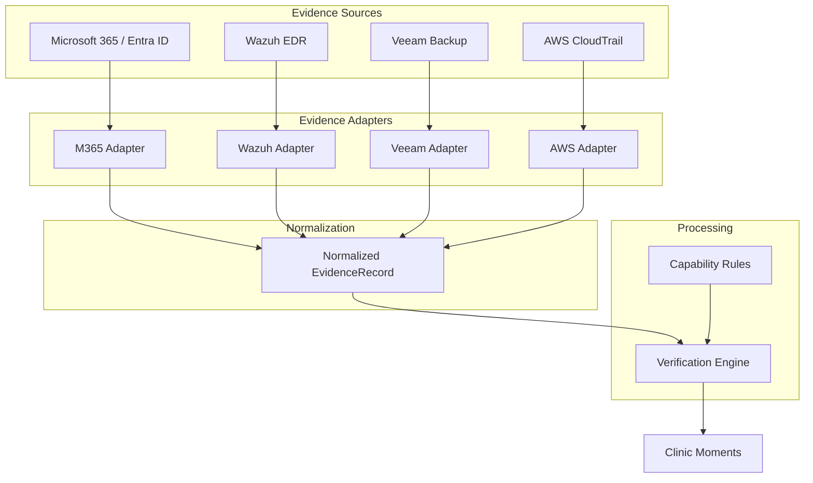

# Evidence Ingestion Architecture

ResilAI relies on deterministic, API-driven evidence to verify organizational readiness. To support multiple diverse systems (e.g., Microsoft 365, Splunk, Veeam, AWS) without hardcoding logic for every tool, ResilAI employs an integration-agnostic Evidence Ingestion Architecture.

## Core Concepts

The architecture consists of four primary layers:

1. **Evidence Source**: The external system generating telemetry or logs (e.g., Azure AD, Wazuh, Veeam Backup).
2. **Evidence Adapter**: A thin translation layer that connects to the Evidence Source API, authenticates, and extracts raw events or state data.
3. **Normalized EvidenceRecord**: The unified, immutable data structure that all Evidence Adapters produce. It standardizes identity, timestamp, scope, and payload across all integrations.
4. **Verification Engine**: The core logic that evaluates `EvidenceRecord` objects against defined security capabilities and compliance rules to generate `Moments` and the final `DailyReadinessReport`.

## Architecture Flow



### 1. Evidence Source
External systems are queried either via scheduled polling jobs or webhook push mechanisms (depending on the source capabilities). Each source has its own proprietary schema.

### 2. Evidence Adapter (Provider)
Adapters are lightweight Python classes implementing a standard interface:
- **Authentication**: Managing OAuth tokens, API keys, or certificates.
- **Extraction**: Calling the specific vendor APIs (e.g., Microsoft Graph API, Wazuh REST API).
- **Transformation**: Mapping vendor-specific JSON into a `RawEvent`, then extracting it into an `EvidenceRecord`.

### 3. Normalized EvidenceRecord
All telemetry is reduced to an `EvidenceRecord`. This ensures the Verification Engine does not need to understand what an "Entra ID User" or a "Veeam Job" is.

```python
class EvidenceRecord(BaseModel):
    id: str
    organization_id: str
    timestamp: datetime
    source_system: str          # e.g., "microsoft", "wazuh"
    evidence_type: str          # e.g., "identity.user.state", "backup.job.status"
    target_entity_id: str       # e.g., "user@clinic.com", "server-01"
    state: Dict[str, Any]       # The normalized state (e.g., {"mfa_enforced": True})
    raw_event_id: str           # Pointer back to the raw vendor JSON for audit
```

### 4. Verification Engine
The engine evaluates the normalized `EvidenceRecord` stream against declarative rules. If a rule fails (e.g., `identity.user.state` indicates `mfa_enforced: False`), the engine generates an active `Moment` (Needs Attention).

## Design Principles

- **Immutability**: Once an `EvidenceRecord` is written to the ledger, it cannot be altered. This guarantees audit integrity.
- **Fail-Safe Defaults**: If an Evidence Adapter fails to run (e.g., authentication failure, API timeout), the system produces no `EvidenceRecord`. The Verification Engine treats missing evidence as an "Unknown" or "Unverified" state—it never assumes the system is healthy without proof.
- **Extensibility**: Adding a new integration (e.g., CrowdStrike) only requires writing a new Evidence Adapter. The Verification Engine and Frontend require zero changes.
