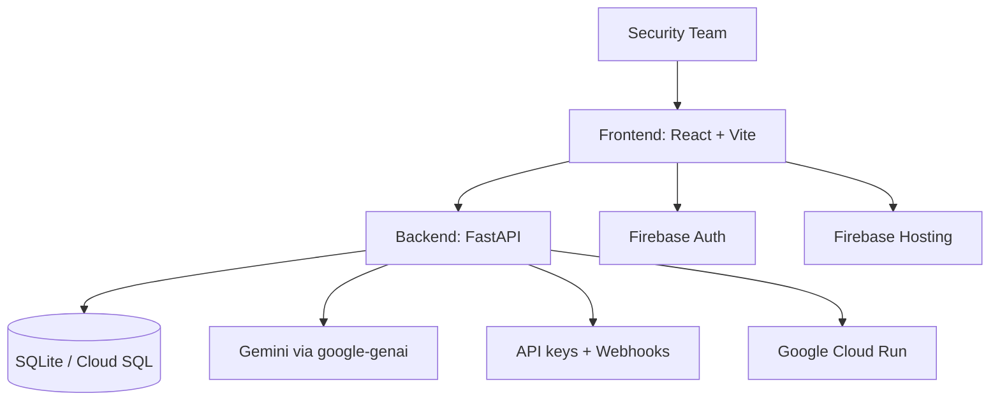

# ResilAI Overview

  

ResilAI is an **AI Incident Readiness Platform** that helps organizations evaluate readiness, prioritize risk reduction, and communicate posture to executives.

## Audience

| Audience | Primary Outcome |
| --- | --- |
| CISOs and Security Leaders | Executive risk visibility and prioritized actions |
| Security Engineering Teams | Gap detection and operational remediation plans |
| Consultants and Advisors | Repeatable assessments and board-ready outputs |
| Design Partners | Early access and direct product influence |

## Core Capabilities

1. Deterministic readiness scoring
2. Framework alignment for MITRE ATT&CK, CIS Controls, and OWASP
3. Executive and full-detail PDF reporting
4. API keys and webhooks for platform integration
5. Public status and operational diagnostics

## Public Beta Flow

1. Create or select an organization
2. Run an assessment
3. Review readiness score and top risks
4. Download Executive Risk Summary
5. Configure integrations (API keys, webhooks, external findings)

## Architecture Snapshot

## What Differentiates ResilAI

| Area | ResilAI Approach |
| --- | --- |
| Scoring | Deterministic and reproducible |
| AI usage | Narrative generation only |
| Integration | API-first with webhook support |
| Reporting | Executive-ready artifacts |
| Deployment | Local, staging, and production separation |

## Links

- Public Beta: `https://airs-staging-0384513977.web.app`
- Staging API health: `https://airs-api-staging-227825933697.us-central1.run.app/health`
- Staging API docs: `https://airs-api-staging-227825933697.us-central1.run.app/docs`
- Docs index: `index.md`
