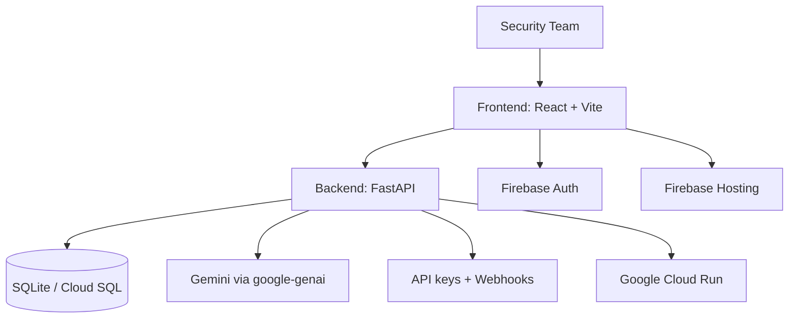

# ResilAI Overview

  

ResilAI is a **Deterministic Governance Factory** that helps organizations evaluate readiness, execute automated compliance validations, and programmatically verify their overall security compliance posture.

## Audience

| Audience | Primary Outcome |
| --- | --- |
| CISOs and Security Leaders | Executive risk visibility and prioritized actions |
| Security Engineering Teams | Gap detection and operational remediation plans |
| Consultants and Advisors | Repeatable assessments and board-ready outputs |
| Design Partners | Early access and direct product influence |

## Core Capabilities

1. Deterministic readiness scoring
2. Framework alignment for MITRE ATT&CK, CIS Controls, and OWASP
3. Executive and full-detail PDF reporting
4. API keys and webhooks for platform integration
5. Public status and operational diagnostics

## Public Beta Flow

1. Create or select an organization
2. Run an assessment
3. Review readiness score and top risks
4. Download Executive Risk Summary
5. Configure integrations (API keys, webhooks, external findings)

## Architecture Snapshot

```mermaid
graph TD
  U[Security Team] --> FE[Frontend: React + Vite]
  FE --> BE[Backend: FastAPI]
  FE --> AUTH[Firebase Auth]
  BE --> DB[(SQLite / Cloud SQL)]
  BE --> LLM[Gemini via google-genai]
  BE --> INT[API keys + Webhooks]
  FE --> FH[Firebase Hosting]
  BE --> CR[Google Cloud Run]
```

## What Differentiates ResilAI

| Area | ResilAI Approach |
| --- | --- |
| Scoring | Deterministic and reproducible |
| AI usage | Narrative generation only |
| Integration | API-first with webhook support |
| Reporting | Executive-ready artifacts |
| Deployment | Local, staging, and production separation |

## Links

- Live Demo: `https://demo.resilai.org`
- Staging API health: `https://api-staging.resilai.org/health`
- Staging API docs: `https://api-staging.resilai.org/docs`
- Docs index: `index.md`
